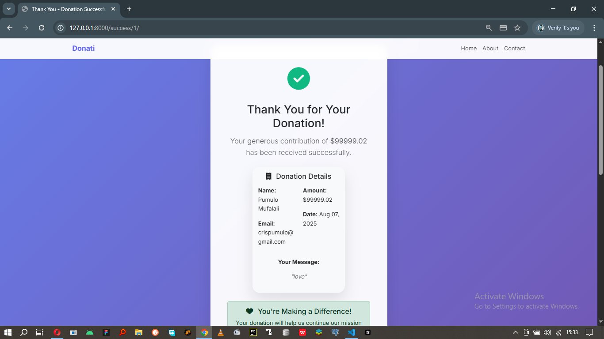

# Donation App with Stripe Integration

A beautiful and modern donation application built with Django, Bootstrap, and Stripe payment processing.

## Features

- **Modern UI/UX**: Beautiful, responsive design with Bootstrap 5
- **Secure Payments**: Stripe integration for safe payment processing
- **Mobile Responsive**: Works perfectly on all devices
- **Security**: CSRF protection and secure payment handling
- **Admin Panel**: Django admin interface for managing donations
- **Email Integration**: Ready for email confirmation setup
- **Social Sharing**: Built-in social media sharing functionality

## Pages

1. **Home Page** (`home.html`): Landing page with donation form
2. **Success Page** (`success.html`): Confirmation page after successful donation

3. **Cancel Page** (`cancel.html`): Page shown when donation is cancelled
4. **Base Template** (`base.html`): Common layout and styling

## Technology Stack

- **Backend**: Django
- **Frontend**: HTML5, CSS3, Bootstrap
- **Payment**: Stripe API
- **Database**: SQLite
- **Icons**: Font Awesome
- **Fonts**: Google Fonts (Inter)

## Testing

For testing payments, use Stripe's test card numbers:
- **Success**: 4242 4242 4242 4242
- **Decline**: 4000 0000 0000 0002
- **Expired**: 4000 0000 0000 0069